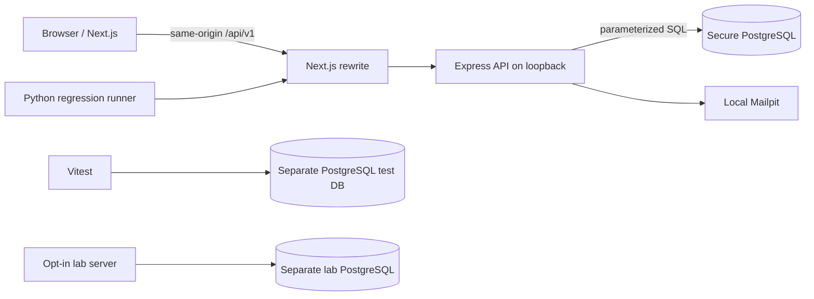

# Architecture and important decisions

Next.js renders the interface and proxies `/api/*` to Express at `127.0.0.1:4000`. The browser sees one origin, `http://localhost:3000`. Express supplies all balances and records; there are no hard-coded dashboard totals. The API and databases bind their exposed host ports to loopback. There is no wildcard credentialed CORS.

`pg` keeps SQL and transaction boundaries visible to the learner. `node-pg-migrate` records applied schema migrations. Use the same checked-out connection for BEGIN, all statements, COMMIT/ROLLBACK; using pool.query inside the transaction callback would lose this guarantee. PostgreSQL is used for integration and concurrency tests, not an in-memory substitute.

## Authentication

Passwords use Argon2id (19 MiB, 2 iterations, parallelism 1). Each password has its own library-generated salt. Sessions are opaque 256-bit random credentials; only SHA-256 digests are stored in PostgreSQL. Fast SHA-256 is suitable for high-entropy random tokens, not for human passwords. Sessions expire after eight hours. Logout removes the current server record; password changes and resets revoke all sessions. Public input cannot assign roles.

The browser holds the session in a host-only HttpOnly SameSite=Strict cookie. In local HTTP development, Secure is false. Production configuration requires HTTPS and Secure cookies with `__Host-` names; the current local proxy/deployment setup is not a public production deployment recipe.

State-changing requests require an exact configured Origin and a double-submit CSRF token from a host-only HttpOnly cookie. JavaScript obtains the token from `/auth/csrf`; login rotates it. Session credentials never enter localStorage. An XSS flaw would undermine CSRF defenses, which is why comments are rendered as text as well. The API rate limiter is process-local: 30 attempts per 15 minutes for authentication actions; a shared store would be necessary with multiple API instances. Tests explicitly disable throttling to test other behavior without consuming a shared limit.

Reset tokens are random, hashed in storage, single-use, and valid for 20 minutes. The local email contains the raw token in the URL fragment; the browser submits it in a POST body. Password-changing operations serialize on the user row. Reset responses use generic text, but this lab does not claim constant-time email delivery or complete enumeration resistance.

## Transfer and ledger invariant

Amounts arrive as positive integer paise, up to 100,000,000 per transfer. The frontend converts rupee strings using BigInt rather than multiplying a floating-point value. PostgreSQL bigint values are returned as decimal strings. Wallet balances are capped at 9,000,000,000,000 paise, below JavaScript's safe integer limit.

1. Derive sender from the session and validate allowlisted fields.
2. Claim `(sender_id, idempotency_key)` inside a database transaction. A unique index serializes simultaneous use of the same key.
3. If already committed, compare the normalized payload hash. Identical input returns the original transfer; different input returns 409.
4. Lock both wallet rows in ascending wallet-ID order. Read the balance after obtaining the lock.
5. Write the transfer, debit, credit, two signed ledger entries, audit event and key result using the same transaction.
6. Commit together. Any failure rolls everything back, including the key claim.

For each wallet, `balance = SUM(ledger.amount)`. Each transfer has one negative debit and one equal positive credit, so its entries sum to zero. A seed credit is explicitly labeled `seed`, has no transfer ID, and represents the creation of fake funds by setup. The database enforces positive balances, entry shapes, and unique debit/credit entries; application transactions preserve cross-row sums. A reconciliation query tests those sums. This is an instructional ledger, not a complete accounting platform.

Failed requests do not reserve an idempotency key. Successful keys currently persist indefinitely. A browser retry keeps the same key while the confirmation remains open; durable recovery after closing the tab is not implemented.

## Isolation and constraints

The secure entry point never imports `src/lab`. The lab has a separate process, separate database credentials and tables, a Docker opt-in profile, separate cookie names, and a loopback-only port. Open the wallet on `localhost` and the lab on `127.0.0.1`, keeping their browser hosts distinct as documented. Never deploy the lab publicly.

Local DB credentials are demo superuser credentials for easy migration. A real deployment needs a least-privilege application DB role, managed secrets, shared throttling, operational monitoring, cleanup/retention jobs, TLS termination, and a reviewed proxy configuration. No real payment provider, KYC, fraud engine, MFA, backup system, or production security certification is claimed.

## Dependency sources

Versions were resolved from npm and pinned transitively in `package-lock.json`. See [Next.js installation requirements](https://nextjs.org/docs/app/getting-started/installation), [node-postgres transaction guidance](https://node-postgres.com/features/transactions), and [PostgreSQL row locking](https://www.postgresql.org/docs/current/explicit-locking.html). Express 5 handles rejected async route handlers; Zod strict schemas reject unknown writable fields. Python requirements are pinned separately.
